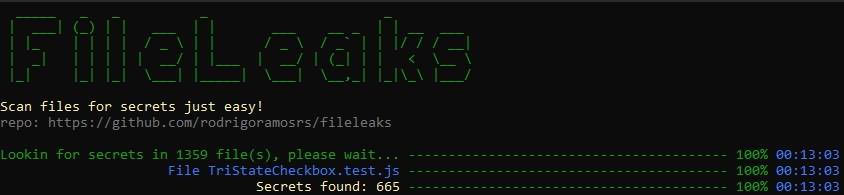

<h1 align=center><code>FileLeaks</code></h1>
<p align=center>
  
</p>

Search files for secrets just easy!

## Features

- Parallelism in the search for secrets. Let topics play...
- Single file
- Works on Linux / Windows / MAC .... Calculator? Perhaps ..
- Made in .NET Core / Standard (why not)? =)
- Open source... Like? use without moderation hahaha

## How to use?

- Windows

```console
$ fileleaks.exe -p {path}
```

- Linux / Mac

```console
$ fileleaks -p {path}
```

You just need to inform the path to scan.

## Next steps

- Enhance paralelism on scan
- Improve result accurracy
- More parameters...

## Credits

Creators:

- [ME](https://github.com/rodrigoramosrs)
- [Edivan Galindo](https://github.com/edivangalindo)

inspiration:

- [gitleaks](https://github.com/zricethezav/gitleaks)
- [trufflehog](https://github.com/trufflesecurity/truffleHog)
